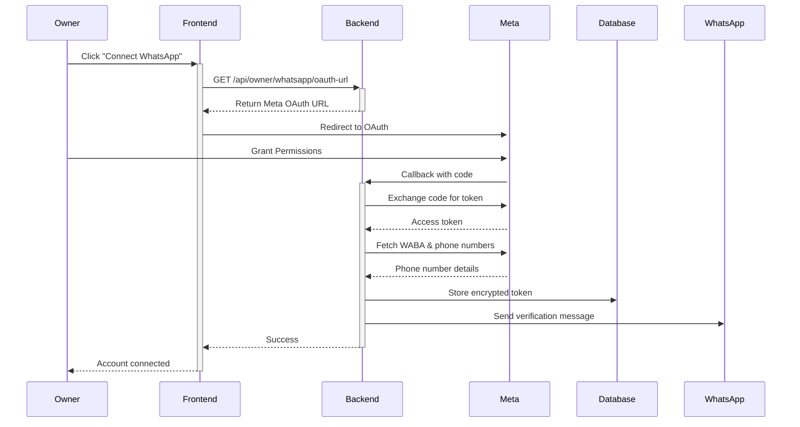

# WhatsApp Multi-Account OAuth Integration

## Overview

This implementation enables store owners to connect multiple WhatsApp Business accounts using Meta OAuth, supporting:

- ✅ Multiple WhatsApp accounts per store
- ✅ Secure OAuth 2.0 flow with encrypted tokens
- ✅ Automatic webhook routing by phone_number_id
- ✅ AI Agent integration (text + voice)
- ✅ Payment screenshot verification flow
- ✅ Restaurant delivery agent support
- ✅ PKR currency defaults
- ✅ Quality rating monitoring
- ✅ Messaging limit tier tracking

## Architecture

### Database Schema

#### 1. **whatsapp_accounts** Table
```sql
- id (bigint, PK)
- store_id (FK → stores)
- phone_number (string, indexed)
- phone_number_id (string, unique) - Meta's phone number ID
- waba_id (string) - WhatsApp Business Account ID
- access_token (text, encrypted) - Meta access token
- status (enum: pending, active, inactive, failed)
- display_name (string, nullable)
- quality_rating (string) - GREEN, YELLOW, RED
- messaging_limits (json) - Rate limit tier from Meta
- verified_at (timestamp, nullable)
- last_webhook_at (timestamp, nullable)
- webhook_verification_token (text, encrypted)
- meta (json) - Additional metadata
- timestamps, soft deletes
```

#### 2. **stores** Table (Updated)
```sql
Added columns:
- whatsapp_account_id (FK → whatsapp_accounts, nullable) - Default account
- ai_enabled (boolean, default: true)
- storefront_enabled (boolean, default: false)
```

#### 3. **orders** Table (Already Updated)
```sql
Existing columns:
- payment_method_id (FK → payment_methods)
- payment_proof_path (string, nullable) - Screenshot path
- conversation_state (string) - AI conversation state
- conversation_context (json) - Context for AI
- payment_status (enum) - pending_verification | paid | rejected
```

### Webhook Flow

#### Single Global Webhook
```
https://your-domain.com/api/webhooks/whatsapp
```

**How it works:**
1. Webhook receives payload with `phone_number_id`
2. System looks up `WhatsappAccount` by `phone_number_id`
3. Retrieves associated Store
4. Switches to Store's tenant database
5. Processes message with correct Store context

**No per-store webhooks needed!**

### OAuth Flow



## API Endpoints

### Owner Dashboard (Authenticated)

| Method | Endpoint | Description |
|--------|----------|-------------|
| GET | `/api/owner/whatsapp/accounts` | List all WhatsApp accounts |
| GET | `/api/owner/whatsapp/oauth-url` | Get Meta OAuth URL |
| POST | `/api/owner/whatsapp/accounts/{id}/disconnect` | Remove account |
| POST | `/api/owner/whatsapp/accounts/{id}/set-default` | Set as default |
| POST | `/api/owner/whatsapp/accounts/{id}/toggle-status` | Activate/deactivate |
| POST | `/api/owner/whatsapp/accounts/{id}/refresh` | Refresh account info |

### Webhooks (Public)

| Method | Endpoint | Description |
|--------|----------|-------------|
| GET | `/api/webhooks/whatsapp` | Webhook verification |
| POST | `/api/webhooks/whatsapp` | Incoming messages/status |
| GET | `/api/whatsapp/callback` | OAuth callback |

## Configuration

### Environment Variables

Add to `.env`:

```env
# Meta / Facebook App
META_APP_ID=your_meta_app_id
META_APP_SECRET=your_meta_app_secret
META_REDIRECT_URI="${APP_URL}/api/whatsapp/callback"

# Legacy (optional - for backward compatibility)
WHATSAPP_TOKEN=your_whatsapp_token
WHATSAPP_PHONE_ID=your_phone_id
WHATSAPP_WEBHOOK_VERIFY_TOKEN=your_verify_token
```

### Meta App Setup

1. **Create Meta App** at developers.facebook.com
   - Type: Business
   - Add WhatsApp product

2. **Configure OAuth**
   - Valid OAuth Redirect URIs: `https://your-domain.com/api/whatsapp/callback`
   - Scopes: `whatsapp_business_management`, `whatsapp_business_messaging`

3. **Configure Webhook**
   - Callback URL: `https://your-domain.com/api/webhooks/whatsapp`
   - Verify Token: Generated automatically per account
   - Webhook Fields: `messages`, `message_status`

4. **Go Live**
   - Submit app for review
   - Request advanced access for WhatsApp permissions

## Models

### WhatsappAccount

```php
// Relationships
$account->store; // BelongsTo Store

// Scopes
WhatsappAccount::active()->get(); // Only active accounts
WhatsappAccount::verified()->get(); // Only verified accounts

// Methods
$account->isActive(); // Check if active
$account->isVerified(); // Check if verified
$account->markAsVerified(); // Mark as verified
$account->updateWebhookTimestamp(); // Update last webhook time

// Accessors
$account->formatted_phone; // "+923001234567"
$account->quality_color; // "green", "yellow", "red"

// Auto-encryption
$account->access_token; // Automatically encrypted/decrypted
$account->webhook_verification_token; // Automatically encrypted/decrypted
```

### Store

```php
// Relationships
$store->whatsappAccounts; // HasMany WhatsappAccount
$store->defaultWhatsappAccount; // BelongsTo WhatsappAccount
$store->activeWhatsappAccounts; // HasMany (filtered)

// Methods
$store->getActiveWhatsappAccount(); // Get default or first active account
```

## Services

### WhatsAppService (Updated)

```php
// Multi-account support
$service = new WhatsAppService($account); // Pass account

// Or set later
$service->setAccount($account);

// Backward compatible (uses config)
$service = new WhatsAppService();

// Use in webhook
$account = WhatsappAccount::where('phone_number_id', $phoneId)->first();
$service = new WhatsAppService($account);
$service->sendTextMessage($to, $message);
```

## Frontend (Owner Dashboard)

### WhatsAppAccounts Page

**Location:** `OmniPortal-Owner/src/pages/WhatsAppAccounts.tsx`

**Features:**
- List all connected accounts
- Connect new account via Meta OAuth
- View account status & quality rating
- Set default account
- Activate/deactivate accounts
- Disconnect accounts
- Refresh account info from Meta
- Visual quality indicators (Green/Yellow/Red)

**Usage:**
```tsx
import WhatsAppAccounts from './pages/WhatsAppAccounts';

// Add to router
<Route path="/whatsapp" element={<WhatsAppAccounts />} />
```

## Security

### Encryption
- Access tokens encrypted at rest using Laravel's `encrypt()` helper
- Uses `APP_KEY` from `.env`
- Automatic encryption/decryption via model mutators

### OAuth
- State parameter includes store_id, owner_id, timestamp
- Base64 encoded for tamper detection
- Short-lived authorization codes
- Long-lived access tokens (60 days+)

### Webhook Verification
- Unique verification token per account
- Encrypted in database
- Meta's challenge-response verification
- Signature validation (recommended to add)

## Testing

### 1. Connect WhatsApp Account

```bash
# Start servers
cd OmniPortal-Backend && php artisan serve --port=8000
cd OmniPortal-Owner && npm run dev

# Steps:
1. Login as owner
2. Navigate to /whatsapp
3. Click "Connect WhatsApp Account"
4. Login with Facebook
5. Grant permissions
6. Account should appear in list
```

### 2. Test Webhook

```bash
# Send test message to WhatsApp number
# Check logs
tail -f storage/logs/laravel.log

# Verify:
- Webhook received ✓
- Account found by phone_number_id ✓
- Store tenant database switched ✓
- Message processed ✓
```

### 3. Verify AI Integration

```bash
# Send text message to WhatsApp
"I want to order a burger"

# Expected:
- AI agent responds
- Order created in tenant DB
- Conversation state saved
```

## Migration

### From Old System

If you have existing WhatsApp setup in `stores` table:

```php
// Create migration to move to new system
php artisan make:migration migrate_existing_whatsapp_to_accounts

// In migration:
$stores = Store::whereNotNull('whatsapp_business_number')->get();

foreach ($stores as $store) {
    WhatsappAccount::create([
        'store_id' => $store->id,
        'phone_number' => $store->whatsapp_business_number,
        'phone_number_id' => $store->whatsapp_business_id,
        'access_token' => config('services.whatsapp.token'),
        'status' => 'active',
        'verified_at' => now(),
    ]);
}
```

## Troubleshooting

### Account Not Found
**Issue:** Webhook can't find account
**Solution:** Check `phone_number_id` in webhook payload matches DB

### Token Expired
**Issue:** API calls fail with auth error
**Solution:** Use refresh endpoint or reconnect account

### Webhook Not Receiving
**Issue:** No webhooks coming in
**Solution:** 
1. Verify URL is publicly accessible
2. Check SSL certificate is valid
3. Verify webhook subscribed in Meta App Dashboard

### Quality Rating Low
**Issue:** Account showing RED quality
**Solution:**
1. Review message templates
2. Reduce spam/block rate
3. Improve response time
4. Follow WhatsApp Business Policy

## Best Practices

1. **Always use default account** for store messaging
2. **Monitor quality ratings** regularly
3. **Refresh account info** weekly via API
4. **Log all webhook payloads** for debugging
5. **Implement retry logic** for failed messages
6. **Rate limit** outgoing messages per tier
7. **Handle token refresh** gracefully
8. **Backup webhook tokens** securely

## Future Enhancements

- [ ] Token auto-refresh before expiry
- [ ] Webhook signature validation
- [ ] Message template management
- [ ] Analytics dashboard per account
- [ ] Multi-language support
- [ ] Conversation flows builder
- [ ] A/B testing for messages
- [ ] Account health monitoring

## Support

For issues:
1. Check logs: `storage/logs/laravel.log`
2. Verify environment variables
3. Test Meta API access
4. Review webhook payloads
5. Contact Meta Business Support for API issues

---

**Version:** 1.0  
**Last Updated:** January 9, 2026  
**Author:** OmniPortal Team
